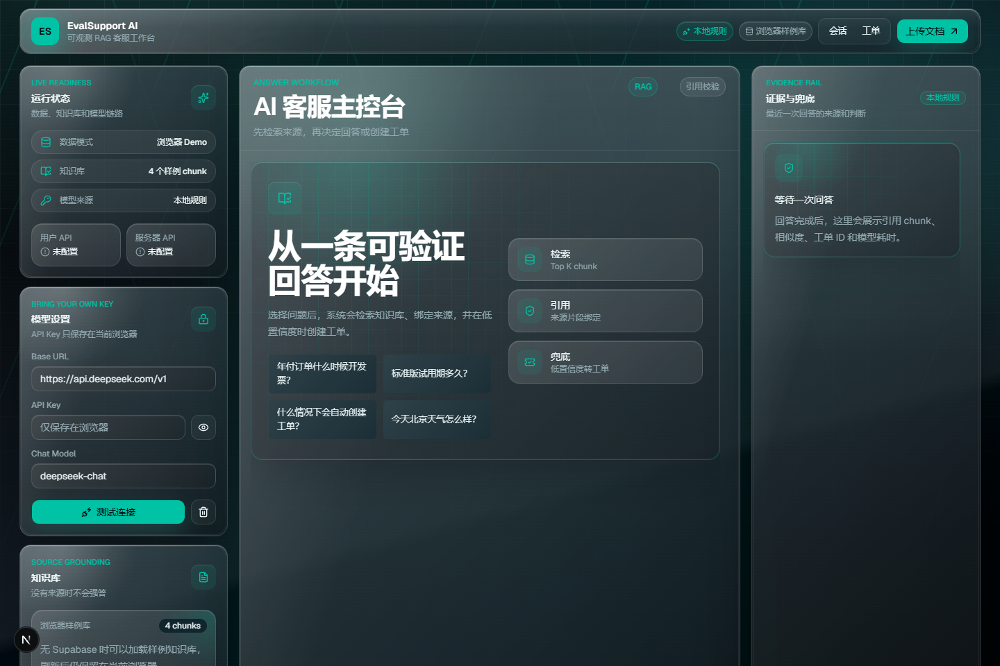
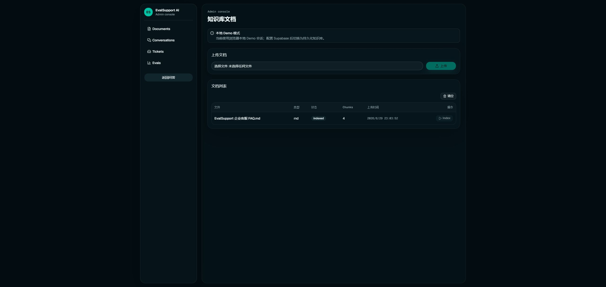
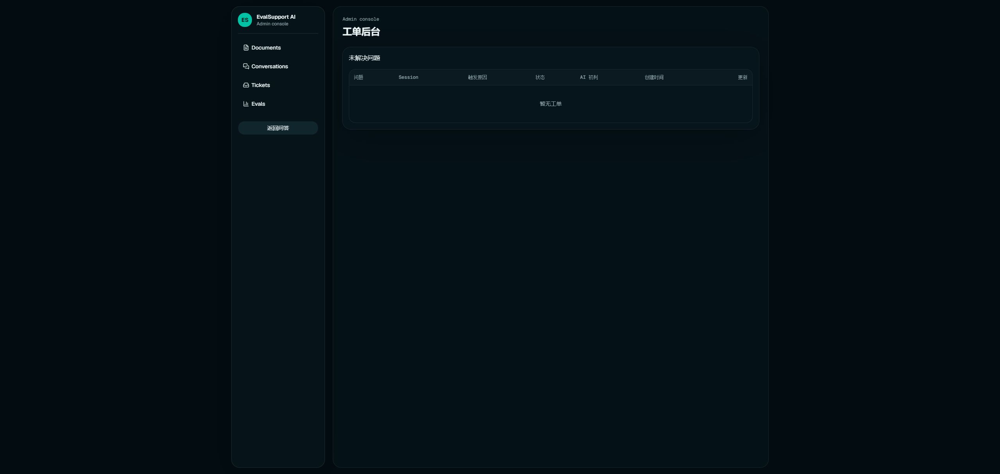
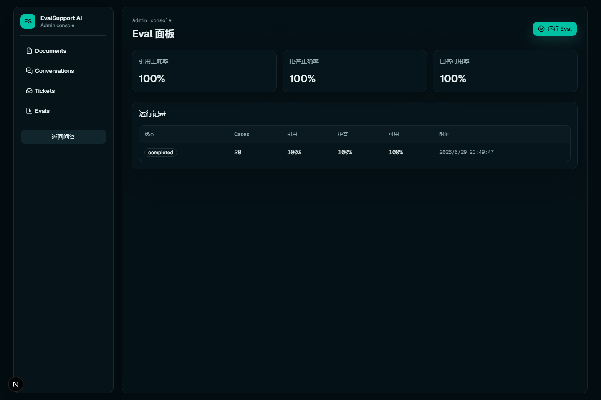
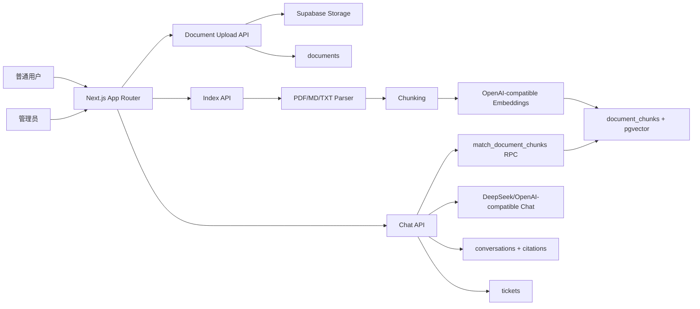
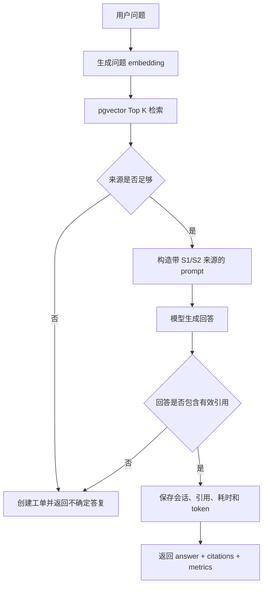

# EvalSupport AI

一个面向企业客服场景的 RAG Agent 系统，支持知识库问答、来源引用、低置信度工单兜底、会话追踪和自动化评测，用来验证大模型回答的准确性、可解释性和业务可用性。

项目定位：GitHub 求职作品，本地可运行、可测试、可截图演示。

## Screenshots










Security policy: [SECURITY.md](SECURITY.md)

## Architecture



## RAG Flow



## Features

- 文档上传：支持 `.pdf`、`.md`、`.txt`。
- 知识库索引：解析文档、按约 900 字符切 chunk、生成 embedding、写入 pgvector。
- RAG 问答：检索 Top K chunk，回答必须包含 `[S1]` 形式的来源引用。
- 工单兜底：低相似度、无来源、模型缺引用时不强答，自动创建工单。
- 用户自带 API：前端可填写 OpenAI-compatible Base URL、API Key 和 Chat Model。
- 管理后台：文档、会话、引用数量、工单状态和 Eval run 记录可查看。
- 本地 Eval：20 条固定测试集统计引用正确率、拒答正确率和回答可用率。
- 可测试核心：chunk、引用、阈值和 RAG service 分支有 Vitest 覆盖。

## Tech Stack

- Frontend: Next.js App Router, TypeScript, Tailwind CSS, shadcn/ui
- Backend: Next.js Route Handlers
- Database: Supabase Postgres
- Vector Search: pgvector
- Storage: Supabase Storage
- AI API: OpenAI-compatible API; chat can use DeepSeek
- Tests: Vitest

## Local Setup

```bash
npm install
cp .env.example .env.local
npm run dev
```

Do not commit `.env.local`. The repo ignores `.env*` by default.

If Supabase environment variables are not configured, the app automatically runs in local demo mode:

- uploaded files are parsed by the upload API
- demo chunks are stored in the browser session after upload
- the admin Documents page can mark browser-stored chunks as indexed
- `/api/chat` can answer from request-scoped demo chunks
- `/api/chat` uses a deterministic local grounded answer generator
- local development also keeps conversations, citations and tickets in process memory until the dev server restarts

This mode is for portfolio demos and tests. Configure Supabase for persistent storage, pgvector retrieval, durable session tracking and admin history.

DeepSeek chat example:

```bash
OPENAI_BASE_URL=https://api.deepseek.com/v1
CHAT_MODEL=deepseek-chat
OPENAI_API_KEY=<your-provider-key>
```

Embeddings require an OpenAI-compatible `/embeddings` endpoint. For local UI/demo work without a remote embedding provider, set:

```bash
EMBEDDING_PROVIDER=local
```

## Bring Your Own Key

首页的“模型设置”支持用户自带 OpenAI-compatible API：

- `Base URL` 默认是 `https://api.deepseek.com/v1`
- `Chat Model` 默认是 `deepseek-chat`
- `API Key` 只保存在当前浏览器 `localStorage`
- API Key 不写入数据库、不写入会话 metadata、不返回前端响应
- 对话时 API Key 会随 `/api/chat` 请求发送到本应用服务端，由服务端代理调用模型

新增连接测试接口：

```http
POST /api/provider/test
```

请求体：

```json
{
  "providerConfig": {
    "baseUrl": "https://api.deepseek.com/v1",
    "apiKey": "<browser-only-key>",
    "chatModel": "deepseek-chat"
  }
}
```

生产级产品应接入更严格的密钥托管、租户隔离、额度控制和审计策略。当前实现只面向 portfolio demo 和用户自带 key 的临时体验。

## Supabase Setup

The Supabase CLI is installed as a dev dependency:

```bash
npm run supabase:version
```

Local Supabase requires Docker Desktop. If Docker is installed, you can run:

```bash
npm run supabase:start
```

Production setup:

1. Create a Supabase project.
2. Enable the `vector` extension.
3. Link the project with `npx supabase link --project-ref <project-ref>`.
4. Run `npm run supabase:db:push`.
5. Confirm the private Storage bucket `knowledge-base` exists. Migration `0002` creates it when the Supabase storage schema is available.
6. Optionally run `supabase/seed.sql` to add 20 eval cases.
7. Upload `docs/sample-knowledge-base.md` from `/admin/documents`, then click `Index`.

Required environment variables:

```bash
SUPABASE_URL=
SUPABASE_SERVICE_ROLE_KEY=
SUPABASE_STORAGE_BUCKET=knowledge-base
OPENAI_API_KEY=
OPENAI_BASE_URL=https://api.deepseek.com/v1
CHAT_MODEL=deepseek-chat
EMBEDDING_PROVIDER=local
EMBEDDING_MODEL=text-embedding-3-small
EMBEDDING_DIM=1536
RAG_TOP_K=5
RAG_MIN_SIMILARITY=0.72
```

## Database Schema

- `documents`: source file metadata, parse/index status, chunk count.
- `document_chunks`: chunk text, document reference, page/position metadata, `vector(1536)` embedding.
- `customer_sessions`: anonymous browser sessions stored as token hashes.
- `conversations`: question, answer, anonymous session, status, model, latency and token metrics.
- `citations`: answer-to-chunk references with similarity and snippet.
- `tickets`: fallback cases with anonymous session, trigger reason and workflow status.
- `eval_cases`: fixed questions, expected sources and expected behavior.
- `eval_runs`: metric snapshots and per-case result JSON.

## API Surface

- `POST /api/documents/upload`
- `GET /api/documents`
- `POST /api/documents/:id/index`
- `POST /api/chat`
- `POST /api/provider/test`
- `GET /api/runtime/status`
- `GET /api/conversations`
- `GET /api/tickets`
- `PATCH /api/tickets/:id`
- `POST /api/evals/run`
- `GET /api/evals/runs/:id`

`POST /api/chat` can optionally receive a browser-only chat provider override:

```json
{
  "question": "标准版试用期多久？",
  "providerConfig": {
    "baseUrl": "https://api.deepseek.com/v1",
    "apiKey": "<browser-only-key>",
    "chatModel": "deepseek-chat"
  }
}
```

Response:

```json
{
  "status": "answered",
  "answer": "... [S1]",
  "citations": [],
  "ticket": null,
  "conversationId": "...",
  "metrics": {
    "latencyMs": 1234,
    "topSimilarity": 0.88,
    "totalTokens": 512,
    "model": "deepseek-chat"
  }
}
```

## Testing

Full local portfolio gate:

```bash
npm run test:portfolio
```

The portfolio gate runs safety, docs link checks, lint, unit tests, production build, runtime smoke test and conversation regression. It reuses an existing app/mock server when available, otherwise starts them for the runtime checks.
It also runs an admin regression check for ticket status updates, conversation history and admin page rendering.

Individual checks:

```bash
npm run test:safety
npm run test:docs
npm run lint
npm test
npm run build
npm run test:smoke
npm run test:conversation
npm run test:admin
```

GitHub Actions CI runs the same safety, docs, lint, unit, build, smoke, conversation and admin checks defined in `.github/workflows/ci.yml`.

Local BYOK and chat smoke test without a real provider key:

```bash
npm run mock:ai
```

Then use these values in the homepage Model Settings panel:

```bash
Base URL=http://127.0.0.1:4010/v1
API Key=mock-browser-key
Chat Model=mock-chat
```

For local manual runs, `npm run test:smoke`, `npm run test:conversation` and `npm run test:admin` expect the app to be running. The smoke and conversation checks also use the mock provider:

```bash
npm run dev -- --hostname 127.0.0.1 --port 3000
npm run mock:ai
npm run test:smoke
npm run test:conversation
npm run test:admin
```

Manual functional check:

- Open `http://127.0.0.1:3000`.
- Confirm the glass workbench shows Model Settings, Chat, and Evidence panels.
- In local demo mode, confirm the sample knowledge base is available as `4 chunks`.
- Ask `年付订单什么时候开发票？` and verify the answer contains `[S1]`.
- Ask `今天北京天气怎么样？` and verify a fallback ticket is created.
- Upload a `.md` document in `/admin/documents`, click `Index`, then ask a question covered by that document.
- Open `/admin/conversations` and `/admin/tickets` to verify records are visible.

Current unit coverage focuses on:

- document type validation
- chunk splitting stability
- similarity threshold fallback
- citation label validation
- ticket creation branches in the RAG service

## Limitations

- MVP does not implement authentication; `/admin/*` is intentionally open for portfolio/demo simplicity.
- Local demo eval runs a deterministic 20-case dataset; Supabase-backed custom eval execution is a follow-up extension.
- DeepSeek can power chat through the OpenAI-compatible API. Embeddings may require another compatible provider or local fallback.
- Supabase service role key is used server-side only and must never be exposed to client code.

## Roadmap

- Supabase Auth admin role protection
- Supabase-backed configurable eval runner with custom datasets and scoring history
- retrieval parameter comparison panel
- prompt version history
- Docker local Postgres + pgvector setup
- Supabase-backed production demo dataset

## License

MIT License. See [LICENSE](LICENSE).
